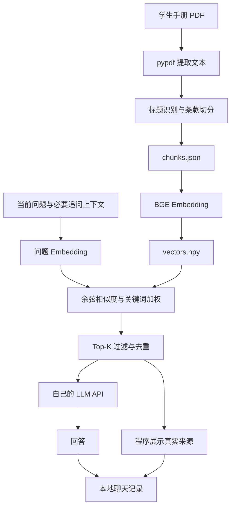

# 南京邮电大学校园知识助手

**下载到自己的电脑，双击快捷方式，接入自己的 API，即可查阅学生手册。**

基于《南京邮电大学学生手册（2025版）》的本地 RAG 应用，回答学籍、考试、处分、奖学金等问题，并展示真实来源原文。

这是学生个人项目，非学校官方服务。每个人使用自己的 API、承担自己的调用费用；项目不提供共享密钥或统一在线问答服务。

## 同学如何使用（Windows 64 位）

1. 在 GitHub 点击 **Code → Download ZIP**，将压缩包完整解压到一个固定目录，例如 D:\NJUPT-Assistant。
2. 第一次双击 **setup.bat**，等待安装完成。无需懂 Python，也无需手动输入命令。没有现有环境时，安装器自动下载仅供本应用使用的 Python 和依赖；已有 .venv 时直接使用，不删除或重建。
3. 安装完成后，桌面会出现 **NJUPT Campus Assistant** 快捷方式。
4. 打开应用，在「API 管理」填写**你自己的** API Key、Base URL 和模型名称，测试并保存。
5. 返回「校园知识助手」开始提问；关闭窗口后，下次打开会恢复最近的聊天记录。

日常双击桌面快捷方式或 **run_app.bat**。有 Microsoft Edge 时使用应用窗口打开；否则使用默认浏览器，问答服务始终在自己的电脑运行。

**首次安装和首次模型下载需要联网，可能耗时数分钟，依赖占用数百 MB 以上。** 这不是一个完全离线、零下载的单文件 EXE。回答问题也需要连接你选择的 API 服务。

关闭窗口不会立即结束后台服务，可双击 **stop_app.bat** 完全退出。不要移动安装目录；移动后请重跑 setup.bat 更新快捷方式。快捷方式适用于 Windows，macOS/Linux 请使用后面的开发者命令。

## 数据保存在哪里

| 数据 | 保存位置 |
| --- | --- |
| 你自己的 API 配置、密钥 | 项目目录 api_connections.json |
| 最近的聊天及参考来源 | 项目目录 chat_history.json |
| 学生手册、知识片段、向量 | 项目目录 PDF / chunks.json / vectors.npy |
| 首次安装下载的私有运行环境 | .runtime/（已有 .venv 则优先使用） |
| 启动状态、运行日志 | .local/ |
| BGE 模型缓存 | 当前系统用户的 Hugging Face 缓存目录 |

API 配置和聊天记录不上传 GitHub，也不发送给项目作者。密钥目前以本地明文 JSON 保存，请勿把装有个人数据的整个目录转发给别人；分享 GitHub 下载链接即可。

**本地保存不等于完全离线**：调用模型时，问题、必要的最近历史和检索到的手册片段会发给你所配置的 API 服务商。界面仅展示密钥掩码，编辑时留空保留旧密钥。

「新建对话 / 清空聊天」同时清空当前界面和本地聊天文件。单个目录保存一份最近对话，不适合多个人共用同一份安装目录或多个窗口同时编辑。

## 功能与项目亮点

- 本地应用启动器、自动准备依赖、桌面快捷方式、后台退出脚本。
- ChatGPT 风格聊天、基本追问、最近聊天恢复和一键清空。
- BGE 中文向量检索，默认 Top 5，轻量关键词加权、相似度过滤、重复来源合并。
- 规章名称、条款、真实 PDF 页码、相似度和原文均由程序展示；模型不负责生成来源列表。
- API 新增、编辑、获取模型列表、手动模型、测试、删除和默认连接管理。
- UUID 稳定 ID，旧配置自动迁移；删除默认连接后自动选择剩余首项。
- 模型与知识库缓存；数量、维度、数据指纹检查。
- 仅监听 127.0.0.1，不向局域网提供共享 API 服务。

## 技术栈和 RAG 流程

Python、Streamlit、OpenAI Python SDK、sentence-transformers、BAAI/bge-small-zh-v1.5、NumPy、pypdf。CLI 兼容 python-dotenv。没有引入复杂向量数据库或前后端分离。



归一化后的向量点积等于余弦相似度。针对少量文档，NumPy 足够直观，便于学习和解释。

## 核心文件

| 文件 | 职责 |
| --- | --- |
| app.py / pages/ | 导航、聊天界面、API 管理 |
| rag.py | 检索、去重、提示词、最近 6 条历史 |
| knowledge_base.py | 缓存模型、加载索引和一致性校验 |
| api_manager.py | 本地 API 配置和调用 |
| chat_store.py | 本地聊天保存、恢复 |
| build_chunks.py | 正文标题匹配、条款切分 |
| build_index.py | 向量构建、数据指纹 |
| chunks.json / vectors.npy / index_meta.json | 同一批知识库产物 |
| setup.bat / setup.ps1 | 首次准备依赖与桌面快捷方式 |
| run_app.bat / launcher.py | 后台启动与打开应用窗口 |
| stop_app.bat / stop_app.ps1 | 停止本应用后台进程 |
| main.py / config.py | 保留命令行及 .env 配置方式 |
| tests/ / search_test.py | 离线回归和真实检索测试 |
| pdf_test.py / knowledge.txt | 原有学习示例；knowledge.txt 不参与当前 RAG |

## 开发者安装

已有环境直接使用；手动创建新环境可以执行：

```powershell
py -3.12 -m venv .venv
.venv\Scripts\python.exe -m pip install -r requirements.txt
.venv\Scripts\python.exe -m streamlit run app.py
```

本地网页也只使用 API 管理中保存的连接，不会因为设置 OPENAI_API_KEY 或旧的 PUBLIC_MODE 环境变量而启用共享模式。CLI 无默认连接时仍兼容你自己创建的 .env，示例见 .env.example。

## 重建知识库

```powershell
.venv\Scripts\python.exe build_chunks.py
.venv\Scripts\python.exe build_index.py
.venv\Scripts\python.exe search_test.py
```

若使用自动下载的运行环境，将命令中的 .venv\Scripts\python.exe 替换为 .runtime\tools\python.exe。

顺序是先切分、再生成向量；三个数据产物需一起更新。当前有 1,047 条知识片段和 (1047, 512) 的向量，文件仅数 MB，保留在仓库中方便开箱使用。

标题从书签中获取候选，再在正文最多四行中匹配，不依赖可能偏移的书签页码。行首条款识别减少正文引用误切。无法可靠识别的标题回退手册名称。PDF 页码从 1 开始，与印刷页码不同。长条款分段后检索，同页同条款按原顺序合并展示。

## 测试与面试展示

```powershell
.venv\Scripts\python.exe -m unittest discover -s tests -v
.venv\Scripts\python.exe search_test.py
```

[验证报告](docs/validation.md)区分真实模型验证、替身测试和尚未验证的项目。没有宣称未经测量的准确率。

建议面试按 build_chunks.py → build_index.py → knowledge_base.py → rag.py → 聊天页讲解：为什么需要 RAG、切分怎样影响检索、Embedding 与余弦相似度、如何处理追问、为什么来源由程序生成。

截图占位：docs/images/chat.png（聊天）、docs/images/sources.png（展开来源）、docs/images/api.png（API 管理，仅显示掩码）。

## 校园论坛分享

直接分享本 GitHub 仓库地址，并说明“下载解压 → 双击 setup.bat → 配置自己的 API”。不要让同学连接你的电脑，也不要把你的 api_connections.json、.env 或 chat_history.json 打包发出去。

## 边界与后续改进

- 本手册不包含实时校园通知，答案仅辅助查阅，以学校现行规定为准。
- 表格和复杂版式可能丢失结构，更换手册版本需重新检查切分。
- 检索阈值与追问识别是简单启发式；复杂指代、无关问题可能检索不准。
- 参考来源是提供给模型的资料，并不是每句话都经过事实验证。
- 目前是本地个人使用，不含账号系统、多人同步、聊天全文搜索或全局限流。
- 首次安装依赖网络；运行环境、模型和依赖较大。未来可提供经过签名的离线安装包。
- PDF 及派生文本来自现有学生手册，版权属于相应权利方；本项目不声称拥有资料版权。

BGE 说明见[官方模型卡](https://huggingface.co/BAAI/bge-small-zh-v1.5)。独立 Python 运行环境采用[Python 官方文档列出的 NuGet 分发](https://docs.python.org/3.12/using/windows.html#the-nuget-org-packages)。


